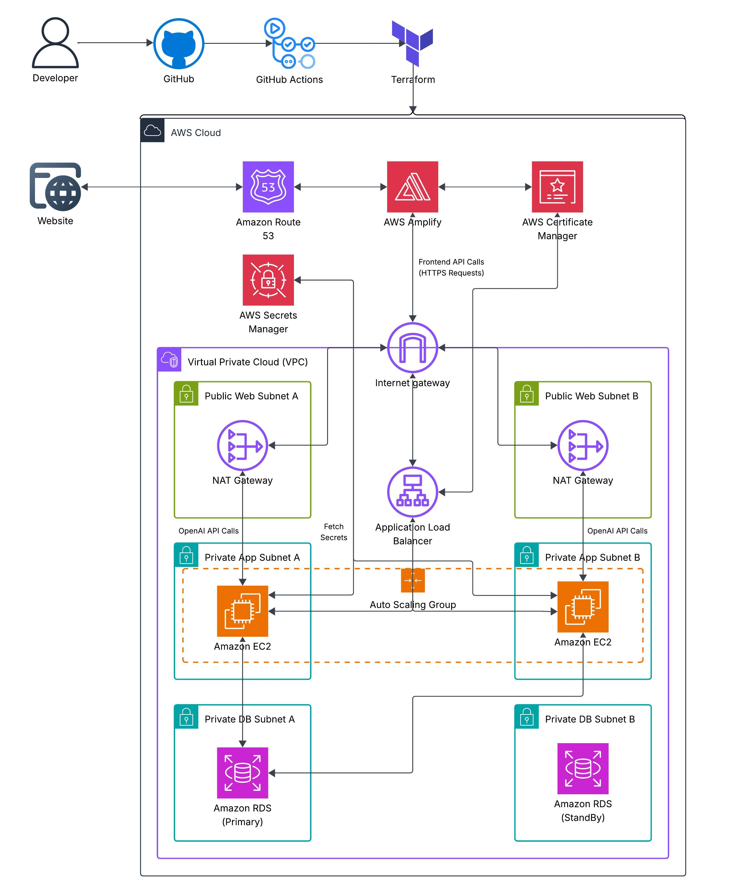

# IAM Policy Generator

IAM Policy Generator is a cloud-native web application that allows users to generate valid AWS IAM policies using plain English. It translates user-provided descriptions (e.g., “Allow full S3 access for logs bucket”) into valid AWS IAM policies using OpenAI's API. Users who sign in with Google can also view and revisit past prompts via a scrollable UI, with all data securely stored in RDS.

This project features a full-stack, multi-tier architecture with a FastAPI backend hosted in a private VPC, an RDS database for storing prompt history, and a secure, scalable frontend hosted with AWS Amplify. The architecture prioritizes high availability, scalability, and fault tolerance — leveraging Auto Scaling Groups for backend EC2 instances, Multi-AZ RDS deployments for failover, and redundant NAT Gateways across public subnets.

---

## 🌐 Video Demo

[Watch the demo](https://www.youtube.com/watch?v=gwHuP2tRXlc)

---

## ☁️ Architecture

**Key AWS Components:**
- **Amplify** – Hosts the frontend
- **ACM + Route 53** – SSL and domain management
- **Application Load Balancer (ALB)** – Routes HTTPS traffic to the backend
- **EC2 (FastAPI App)** – Runs the Python backend in private subnets
- **Auto Scaling Group (ASG)** – Automatically scales EC2 instances based on traffic
- **Multi-AZ RDS (PostgreSQL)** – Stores user prompt history securely with built-in failover
- **Dual NAT Gateways** – Ensures internet access for private subnets with high availability
- **Secrets Manager** – Secures OpenAI API keys and database credentials
- **Terraform** – Infrastructure-as-code for reproducible deployments

---

## 🚀 Features

- Natural language to IAM policy generation via OpenAI
- Syntax-highlighted JSON viewer
- Scrollable history panel (stored in RDS) for signed-in users
- Secure, modular, and cloud-native architecture (frontend, backend, database)
- Highly available, fault tolerant, and scalable infrastructure
- Infrastructure fully built and managed using Terraform

---

## 🧰 Tech Stack

| Layer                | Tech/Service                                              |
|----------------------|-----------------------------------------------------------|
| Frontend             | HTML, CSS, JavaScript                                     |
| Backend              | FastAPI, Python                                           |
| AI Integration       | OpenAI (GPT-4)                                            |
| Hosting              | AWS Amplify (frontend), EC2 (backend)                     |
| Database             | Amazon RDS (PostgreSQL)                                   |
| Networking           | VPC, Private/Public Subnets, ALB, NAT Gateways            |
| Scaling/HA/FT        | Auto Scaling Groups (EC2), Multi-AZ RDS, Dual NAT Gateways|
| Secrets Management   | AWS Secrets Manager                                       |
| Infrastructure       | Terraform                                                 |
| CI/CD                | GitHub Actions                                            |

---

## 🔐 Security Highlights

- **EC2 backend hosted in private subnets** – no direct internet access
- **End-to-end encryption (HTTPS)** – via ACM and Route 53
- **Application Load Balancer** – terminates HTTPS and routes traffic to backend securely
- **Principle of Least Privilege** – tightly scoped IAM role permissions for Terraform and GitHub Actions
- **No secrets stored in code** – all secrets are stored in AWS Secrets Manager

---

## 🔄 CI/CD Workflow

### Frontend – Amplify
- Automatically triggered on pushes to `main`
- Amplify rebuilds and redeploys the static frontend
- Route 53 + ACM maintain HTTPS and domain routing

### Backend – Terraform + GitHub Actions
- On changes to infrastructure code in `main`, GitHub Actions runs `terraform apply` to automatically manage infrastructure updates
- Backend code changes are deployed to EC2 via SSH
- Secrets and config values are pulled dynamically from Terraform outputs and Secrets Manager
